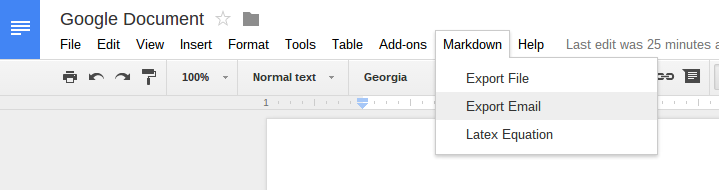

gdocs2md
========

A simple Google Apps script to convert a properly formatted Google Drive Document to the markdown (.md) format. 



## Usage

  * Adding this script to your doc (once per doc):
    * Open your Google Drive document (http://drive.google.com)
    * Tools -> Script Manager > New
    * Select "Blank Project", then paste this code in and save.
    * Clear the myFunction() default empty function and paste the contents of `converttomarkdown.gapps` into the code editor
    * File -> Save
    
  * Running the script (run as many times as you want):
    - Markdown > Export File (Creates a new folder `target` in the same directory as the document. Markdown and image files are stored in it. A warning is generated if a `target` directory already exists) 
    - Markdown > Export Email (Sends you an email with the Markdown and image files)
    - Markdown > Latex Equation (Put your cursor on a equation and run the script. It will output the LaTex formatting in a dialog)


## Interpreted formats
  * Text:
    * paragraphs are separated by two newlines
    * text styled as heading 1, 2, 3, etc is converted to Markdown heading: #, ##, ###, etc
    * text formatted with Courier New is backquoted: ``text``
    * links are converted to MD format: `[anchortext](url)`
  * Lists:
    * Numbered lists are converted correctly, including nested lists
    * bullet lists are converted to "`*`" Markdown format appropriately, including nested lists
  * Images:
    * images are correctly extracted and sent as attachments
  * Drawings: 
    * not supported 
  * Equations:
    * Equations are converted to LaTex equations and surrounded by ``$`` signs 
  * Table of contents:
    * Is replaced by `[[TOC]]`
  * Line breaks: 
    * Inserts a `---`
  * Tables:
    * Converted to Markdown tables following GitHub Markdown syntax. 
  * Source code: 
    * Fenced code blocks are started by three back-ticks and a string and ended by three back-ticks. Single line break is used within fenced code blocks. 

## CONTRIBUTORS

* Renato Mangini - [G+](//google.com/+renatomangini) - [Github](//github.com/mangini)
* Ed Bacher - [G+](//plus.google.com/106923847899206957842) - [Github](//github.com/evbacher)
* Andreas Wolke - [G+](//plus.google.com/+AndreasWolke) - [Github](//github.com/jacksonicson)

## LICENSE

Use this script at your will, on any document you want and for any purpose, commercial or not. 
The MarkDown files generated by this script are not considered derivative work and 
don't require any attribution to the owners of this script. 

If you want to modify and redistribute the script (not the converted documents - those are yours), 
just keep a reference to this repo or to the license info below:

```
Copyright 2013 Google Inc. All Rights Reserved.

Licensed under the Apache License, Version 2.0 (the "License");
you may not use this file except in compliance with the License.
You may obtain a copy of the License at

    http://www.apache.org/licenses/LICENSE-2.0

Unless required by applicable law or agreed to in writing, software
distributed under the License is distributed on an "AS IS" BASIS,
WITHOUT WARRANTIES OR CONDITIONS OF ANY KIND, either express or implied.
See the License for the specific language governing permissions and
limitations under the License.
```
