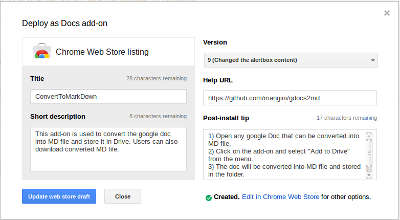

How to publish a Google Doc plugin
========

To convert multiple Google docs into MD file, it is better to publish the script as a domain-restricted plugin. The reason for publishing the plugin as a domain restricted one is that, they are available only within your domain and also the chances of getting faster approval from google to publish the plugin are higher.

##Getting ready for publishing a Google Docs Plugin :

1) Create a dummy document in google doc. Make sure that, you don’t have any sensitive information on this document, as this document has to be shared with google while publishing.

2) Click Tools - > Script Editor. Click on "Blank Project".

3) Type your scripts and save this project. Please note that, the name of the project you save will become the name of the plugin. So please choose a correct name, the first time itself.

4) The script must include an **onInstall(e)** function that populates the menu (usually by calling **onOpen(e)**).

5) Test the script for all the cases. To be sure of, test the same script in another user’s google doc.

6) Make sure that the script has **error-handling code** and only shows appropriate error messages to the user.

7) Don’t forget to **remove all the log messages** before publishing. The plugin will be rejected, if there are any log messages / errors in script.

8) Once you feel, you are ready for publishing the plugin, please visit this link and submit the form. [https://developers.google.com/apps-script/add-ons/publish](https://developers.google.com/apps-script/add-ons/publish)

9) Please select "Publishing preference" option as  “**Publish Domain-Restricted**” in the form above. This will ensure speedy approval from google. However with this option selected, the plugin will be visible only within your domain. If you select “Publish Global” or “Both”, the plugin will be available to anyone using Google Docs. But this option will take a lot of time as Google scrutinizes each and every plugin thoroughly. 

10) Once you have submitted the form, **share the document** which contains the plugin script to the mail id "[appsscriptadvisor@gmail.com](mailto:appsscriptadvisor@gmail.com)". Thats all from your end for now. Keep calm and wait for the mail from google which says your plugin is ready for publishing within your domain. Normally this takes a day or two.  [if it is a domain restricted plugin]

##Publishing a Google Docs Plugin :

1) You can only publish your plugin, only when you get a mail approval from google. Once you got the approval, open the document which contains the script that you have sent for approval. Click on Tools - > Script Editor.

2) Open the File -> Manage Versions. Enter a clear message about this version and click on "**Save new Version**". This version will be published as the plugin.

2) Click on the Publish menu. You should see a menu saying "**Deploy as Docs add-on**". If you can’t see the menu, then probably google has not yet approved, or you might have signed into different account, or you might have opened a wrong document.

3) Click on the "Deploy as Docs add-on" menu. You can see a dialog window like this.

4) The "Title" is the name of the project. It is an auto-populated field. You should not change it, unless you have renamed the project. This will be the name of the plugin

5) Enter "Short Description", “Version”, “Help URL”, and “Post-install tip”. Please note that, you **select the right version** before publishing.

6) If it is the first time you are publishing, Click on "Create web store draft". If you are updating plugin, you will see “Update web store” draft button.

7) Now, you will be taken to the "Developer dashboard" of “Chrome web store” if you accept the terms.

8) If you have previously agreed to the[ Chrome Web Store Terms of Service](https://developers.google.com/chrome/web-store/terms), skip to step 13. If not, you will be prompted to accept the terms of service. Click Review.

9) Read the terms carefully, then click Accept.

10) Close the Chrome Web Store tab and return to the script editor.

11) In the script editor, click Publish -> Deploy as Docs add-on again.

12) In the dialog that appears, click "Create web store draft" again.

13) In the store listing, fill in the details about your add-on. At minimum, you will need to upload a **128px × 128px icon, a 1280px × 800px screenshot, and a 440px × 280px tile image**, as detailed in the[ Chrome Web Store documentation](https://developers.google.com/chrome/web-store/docs/images). (A 920px × 680px large tile is also recommended, since they are sometimes shown for popular add-ons, but the 1400px × 560px marquee tile is not used.) You will also need to select a category and language.

14) In the "Visibility options" section, select which users will be able to find your add-on. If it is an internal plugin, select "**Private**" and then select “**Everyone at your [ domain ]**”.

15) Click Publish changes, then click OK in the dialog that appears.

16) Visit the [Chrome Web Store developer dashboard](https://chrome.google.com/webstore/developer/dashboard) to see the status of your add-on. Once the "Status" column says "Published", your add-on will be available in the store. Publication may take a few minutes.

##Updating a Google Docs Plugin :

1) Open the Google Sheets or Docs file that contains the Apps Script project for your add-on and click Tools -> Script editor.

2) Make the necessary changes to your code, then save a new version of your project by clicking File -> Manage versions, then Save New Version. Close the Manage Versions dialog.

3) Click Publish -> Deploy as Docs add-on. 

4) In the dialog that appears, change your add-ons details as needed and select the new version of your script, then click Update store item. (If you change your add-on's name, make sure you also change the name of the Apps Script project to match, since the script's name is shown in the authorization dialog.)

5) In the store listing, click Publish changes, then click OK in the dialog that appears. Sometimes the publish menu may not appear after updating the plugin. In that case, unpublish the plugin and publish it again. [ Don’t forget to **select the right version** while publishing ]

6) Visit the [Chrome Web Store developer dashboard](https://chrome.google.com/webstore/developer/dashboard) to see the status of your add-on.

##Unpublishing a Google Docs Plugin :

1) To unpublish an add-on, visit the [Chrome Web Store developer dashboard](https://chrome.google.com/webstore/developer/dashboard) and click Unpublish in the listing for your add-on.

